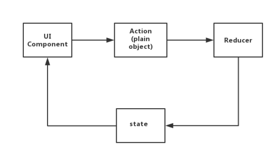
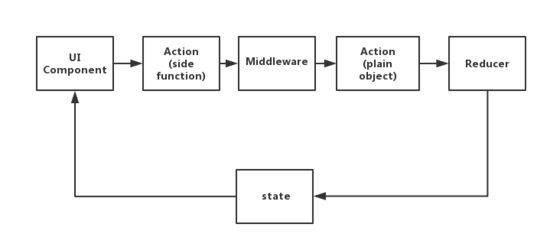

## redux入门以及redux-thunk和redux-actions中间件
> 对于大型的复杂应用来说，这两方面恰恰是最关键的。因此，只用 React 没法写大型应用。
为了解决这个问题，2014年 Facebook 提出了 Flux 架构的概念，引发了很多的实现。2015年，Redux 出现，将 Flux 与函数式编程结合一起，很短时间内就成为了最热门的前端架构
                                                                                        
### 原理


### 配置redux
```javascript
//与redux-thunk中间件如何配置
import { createStore, compose, applyMiddleware } from 'redux';
import thunk from 'redux-thunk';
import reducer from './reducer';

const composeEnhancers = window.__REDUX_DEVTOOLS_EXTENSION_COMPOSE__ || compose;
const store = createStore(reducer, composeEnhancers(
	applyMiddleware(thunk)
));

export default store;
```

### 开发中模块化reducer


```javascript
import { combineReducers } from 'redux-immutable';
import { reducer as headerReducer } from '../common/header/store';
import { reducer as homeReducer } from '../pages/home/store';
import { reducer as detailReducer } from '../pages/detail/store';
import { reducer as loginReducer } from '../pages/login/store';

const reducer = combineReducers({
	header: headerReducer,
	home: homeReducer,
	detail: detailReducer,
	login: loginReducer
});

export default reducer;

```

### 组件使用redux

```javascript
//app.js
import store from './store';
<Provider store={store}>
    ...
    ...
</Provider>
//组件内
//引入connect装饰器
import { connect } from 'react-redux'


//拿到的数据和自定义的方法以props形式传递
//获取数据
const mapState = (state) => ({
	title: state.getIn(['detail', 'title']),
	content: state.getIn(['detail', 'content'])
});
//用于修改数据
const mapDispatch = (dispatch) => ({
	getDetail(id) {
		dispatch(actionCreators.getDetail(id));
	}
});

export default connect(mapState, mapDispatch)(withRouter(Detail));
```

## 中间件


### redux-thunk

redux中的数据流大致是
UI—————>action（plain）—————>reducer——————>state——————>UI


>redux 是遵循函数式编程的规则，上述的数据流中， action 是一个原始js对象（ plain object ）且 reducer 是一个纯函数，对于同步且没有副作用的操作，上述的数据流起到可以管理数据，从而控制视图层更新的目的
 如果存在副作用函数，那么我们需要首先处理副作用函数，然后生成原始的js对象。如何处理副作用操作，在 redux 中选择在发出 action ，到 reducer 处理函数之间使用中间件处理副作用

redux增加中间件处理副作用后的数据流大致如下：

UI——>action(side function)—>middleware—>action(plain)—>reducer—>state—>UI



在有副作用的 action 和原始的 action 之间增加中间件处理，从图中我们也可以看出，中间件的作用就是：

转换异步操作， 生成原始的action ，这样， reducer 函数就能处理相应的 action ，从而改变 state ，更新 UI


### redux-actions

>redux-actions是对redux写法简化，常用有以下两种方法

- createAction：
创建action工厂的一个操作，返回一个action工厂。
第一个参数：action类型
第二个参数：生成action的函数。此函数的可以传递参数，参数值为实际调用action工厂函数时传递的参数。
- handleAction：处理action的操作，返回一个reduce。
第一个参数：action工厂
第二个参数：改变store的state的函数。这里会根据store当前的state数据以及action返回的值返回一个新的state给store。
第三个参数：当store的state啥也没有的时候给定一个初始的state。
这里说的store的state，是针对这里的state.pageMain。


//actions.ts写法
```javascript
import { createAction } from 'redux-actions'
import * as types from './actionTypes'

// 同步action
//返回一个action我们这个一旦dipatch就会被reducer收到
export const changeCompText = createAction(
  types.changeCompText,
  (text: string) => ({
    data: {
      text
    }
  })
)

// 异步action .getDemo
export const getDemo = createAction(types.getDemo, (id: string | number) => {
  return window.apis.getDemo({
    restful: {
      id
    }
  })
})

// 异步action dispatch  .getDemoParallel
export const getDemoParallel = (id: string | number) => {
  return async (dispatch: any, getState: any) => {
    const { data } = await window.apis.getDemo({
      restful: {
        id
      }
    })

    if (data) {
      //getDemoParallel参数
      //从这里可以得出当我们去请求一个异步数据时候得到的数据以后再去dipatch
      dispatch(changeCompText('getDemoParallel'))
    }
  }
}

```

//reducers.ts写法

```javascript
import { handleActions } from 'redux-actions'
import * as types from './actionTypes'
import { IState } from './type'

const initialState: IState = {
  text: 'compa'
}

export default handleActions<any, any>(
  {
    [`${types.changeCompText}`]: (state, action) => ({
      ...state,
      ...action.payload.data
    }),
    [`${types.getDemo}_FULFILLED`]: (state, action) => {
      return {
        ...state,
        ...action.payload.data
      }
    },
    [`${types.getDemo}_REJECTED`]: (state, action) => {
      return {
        ...state
      }
    }
  },
  initialState
)

```